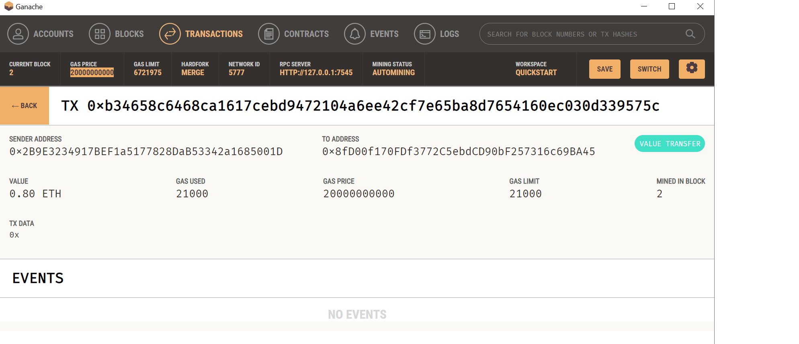
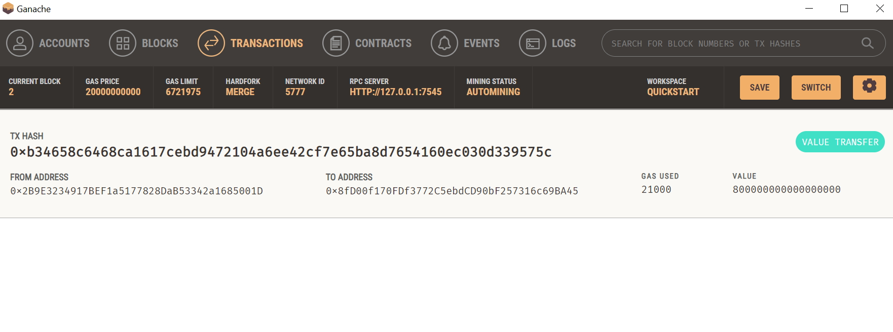
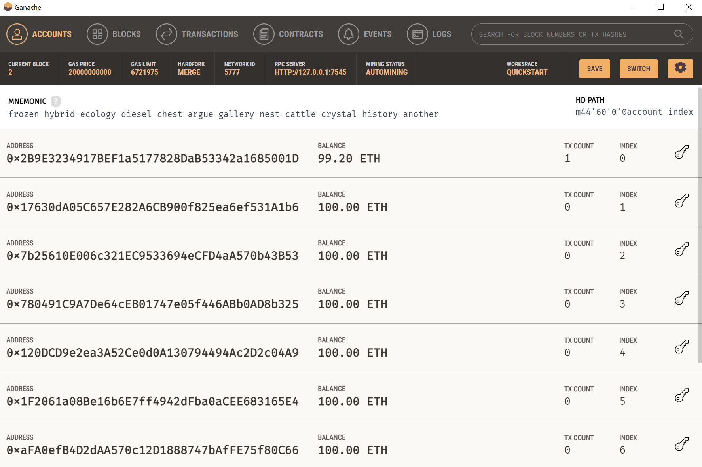

# Module-19-Challenge
In this repository you will find a .py file named Krypto Jobs, in this file we are working in a startup building a new and disruptive application named KryptoJobs2Go. As the lead developer, I’ve been tasked with integrating the Ethereum blockchain network into the application. The purpose is to enable the customers to instantly pay their hired fintech professionals with cryptocurrency.

# Part 1 Import Ethereum Transaction Functions into the KryptoJobs2Go Application
In this section, we will Import several function from Crypto Wallet file that include generate_account, get_balance, send_transaction.
Add mnemonic seed phrase (which Ganache provided) to the KEY1.env file. 
Create a variable named account. Set this variable equal to a call to the generate_account function. 
Define a new st.sidebar.write function that displays the balance of the customer account.

# Part 2 Sign and Run a Payment Transaction
In this part we will write the equation that calculates the candidate’s wage.
Write the wage variable to the Streamlit sidebar by using st.sidebar.write.

# Part 3 Inspect the Transaction in Ganache
In this section, we will test the KryptoJobs2Go application with your newly integrated Ethereum wallet. Testing the transaction by using the web interface of the application, and then look up the resulting transaction in Ganache.

